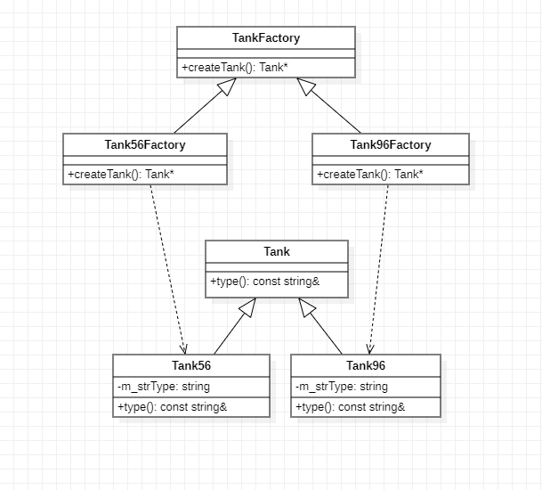

# 工厂方法模式

定义一个创建对象的接口，其子类去具体实现这个接口以完成具体的创建工作。如果需要增加新的产品类，只需要扩展一个相应的工厂类即可。

缺点：产品类数据较多时，需要实现大量的工厂类。

**code**

```c++
/*
工厂方法模式
*/

#include <iostream>

// 产品抽象类

class Tank
{
public:
	virtual const std::string& type() = 0;
};

// 具体产品类
class Tank56 : public Tank
{
private:
	std::string m_strType;

public:
	Tank56() : Tank(), m_strType("Tank56") {}

	const std::string& type() override
	{
		std::cout << m_strType.data() << std::endl;
		return m_strType;
	}
};

// 具体产品类
class Tank96 : public Tank
{
private:
	std::string m_strType;

public:
	Tank96() : Tank(), m_strType("Tank96") {}

	const std::string& type() override
	{
		std::cout << m_strType.data() << std::endl;
		return m_strType;
	}
};

// 抽象工厂类，提供一个创建接口
class TankFactory
{
public:
	// 提供创建产品实例的接口，返回抽象产品类
	virtual Tank* createTank() = 0;
};

// 具体的创建工厂类，使用抽象工厂类提供的接口，去创建具体的产品实例
class Tank56Factory : public TankFactory
{
public:
	Tank* createTank() override
	{
		return new Tank56();
	}
};

// 具体的创建工厂类，使用抽象工厂类提供的接口，去创建具体的产品实例
class Tank96Factory : public TankFactory
{
public:
	Tank* createTank() override
	{
		return new Tank96();
	}
};

int main() {
	TankFactory* factory56 = new Tank56Factory();
	Tank* tank56 = factory56->createTank();
	tank56->type();

	TankFactory* factory96 = new Tank96Factory();
	Tank* tank96 = factory96->createTank();
	tank96->type();

	delete tank96;
	tank96 = nullptr;
	delete factory96;
	factory96 = nullptr;

	delete tank56;
	tank56 = nullptr;
	delete factory56;
	factory56 = nullptr;

	return 0;

}
```

UML



