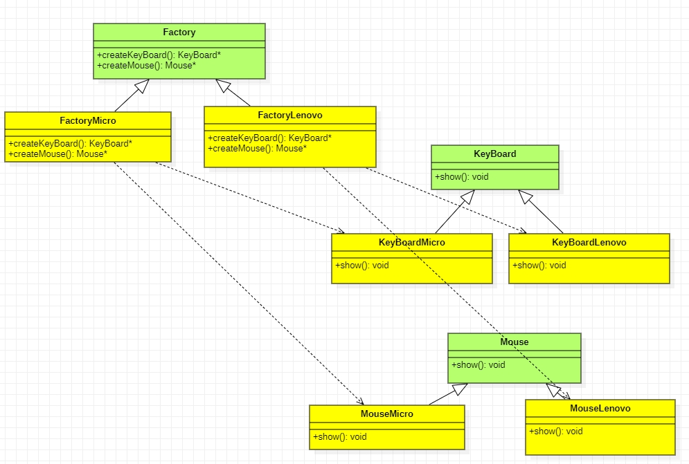

# 抽象工厂模式

> 刘笑
>
> 2022.3.22


抽象工厂模式提供创建一系相关或相互依赖对象的接口，而无需指定它们具体的类。

当存在多个产品系列时，而客户端只使用一个产品系列时，可以考虑使用抽象工厂模式。

缺点：当增加一个新系列的产品时，不仅需要实现具体的产品类，还需要增加一个新的创建接口，扩展相对困难。

**code**

```c++
/*
抽象工厂模式
在一个工厂里聚合多个同类产品。
以白色和黑色衣服为例，白色衣服为一个产品系列，黑色衣服为一个产品系列。
白色上衣搭配白色裤子。
*/

#include <iostream>


// 抽象上衣类
class Coat
{
public:
	virtual const std::string& color() = 0;
};

// 黑色上衣类
class BlackCoat : public Coat
{
private:
	std::string m_strColor;
public:
	BlackCoat() : Coat(), m_strColor("Black Coat") {}
	const std::string& color() override
	{
		std::cout << m_strColor.data() << std::endl;
		return m_strColor;
	}
};

// 白色上衣类
class WhiteCoat : public Coat
{
private:
	std::string m_strColor;
public:
	WhiteCoat() : Coat(), m_strColor("White Coat") {}
	const std::string& color() override
	{
		std::cout << m_strColor.data() << std::endl;
		return m_strColor;
	}
};

// 抽象裤子类
class Pants
{
	virtual const std::string& color() = 0;
};

// 黑色裤子类
class BlackPants : public Pants
{
private:
	std::string m_strColor;
public:
	BlackPants() : Pants(), m_strColor("Black Pants") {}
	const std::string& color() override
	{
		std::cout << m_strColor.data() << std::endl;
		return m_strColor;
	}
};

// 白色裤子类
class WhitePants : public Pants
{
private:
	std::string m_strColor;

public:
	WhitePants() : Pants(), m_strColor("White Pants") {}
	const std::string& color() override
	{
		std::cout << m_strColor.data() << std::endl;
		return m_strColor;
	}
};

// 抽象工厂类，提供衣服创建接口
class Factory
{
public:
	// 上衣创建接口，返回抽象上衣类
	virtual Coat* createCoat() = 0;
	// 裤子创建接口，返回抽象裤子类
	virtual Pants* createPants() = 0;
};

// 创建白色衣服的工厂类，具体实现创建白色上衣和白色裤子的接口
class WhiteFactory : public Factory
{
public:
	Coat* createCoat() override
	{
		return new WhiteCoat();
	}
	Pants* createPants() override
	{
		return new WhitePants();
	}
};

// 创建黑色衣服的工厂类，具体实现创建黑色上衣和白色裤子的接口
class BlackFactory : public Factory
{
	Coat* createCoat() override
	{
		return new BlackCoat();
	}
	Pants* createPants() override
	{
		return new BlackPants();
	}
};
```


抽象工厂模式提供一个创建一系列相关或相互依赖对象的接口，而无需指定它们具体的类。

举个例子吧，就拿键盘和鼠标来说吧，键盘和鼠标就是一些列的类。而键盘鼠标又有微软的和联想的区别。所有有了微软的工厂和联想的工厂。键盘和鼠标具体的创建由工厂来负责，而具体创建微软的还是联想的则由客户端来指定，而客户端根本不用知道鼠标和键盘这些类。此例的示例代码如下：

```c++
#include <iostream>


// 键盘
class KeyBoard
{
public:
	virtual void show() = 0;
};

// 微软的键盘
class KeyBoardMicro : public KeyBoard
{
public:
	void show()
	{
		std::cout << "微软的键盘" << std::endl;
	}
};

// 联想的键盘
class KeyBoardLenovo : public KeyBoard
{
public:
	void show()
	{
		std::cout << "联想的键盘" << std::endl;
	}
};

// 鼠标
class Mouse
{
public:
	virtual void show() = 0;
};

// 微软的鼠标
class MouseMicro : public Mouse
{
public:
	void show()
	{
		std::cout << "微软的鼠标" << std::endl;
	}
};

// 联想的鼠标
class MouseLenovo : public Mouse
{
public:
	void show()
	{
		std::cout << "联想的鼠标" << std::endl;
	}
};

// 工厂
class Factory
{
public:
	virtual KeyBoard* createKeyBoard() = 0;
	virtual Mouse* createMouse() = 0;
};

// 微软的工厂
class FactoryMicro : public Factory
{
public:
	KeyBoard* createKeyBoard()
	{
		return new KeyBoardMicro();
	}

	Mouse* createMouse()
	{
		return new MouseMicro();
	}
};

// 联想的工厂
class FactoryLenovo : public Factory
{
public:
	KeyBoard* createKeyBoard()
	{
		return new KeyBoardLenovo();
	}
	Mouse* createMouse()
	{
		return new MouseLenovo();
	}
};

#include <iostream>

int main()
{
	// 抽象工厂模式
	Factory * p = new FactoryMicro();
	KeyBoard * pKeyBoard = p->createKeyBoard();
	Mouse * pMouse = p->createMouse();
	pKeyBoard->show();
	pMouse->show();
	delete pMouse;
	pMouse = nullptr;
	delete pKeyBoard;
	pKeyBoard = nullptr;
	delete p;
	p = nullptr;

	p = new FactoryLenovo();
	pKeyBoard = p->createKeyBoard();
	pMouse = p->createMouse();
	pKeyBoard->show();
	pMouse->show();
	delete pMouse;
	pMouse = nullptr;
	delete pKeyBoard;
	pKeyBoard = nullptr;
	delete p;
	p = nullptr;

	return 0;
}
```

上述代码UML图



