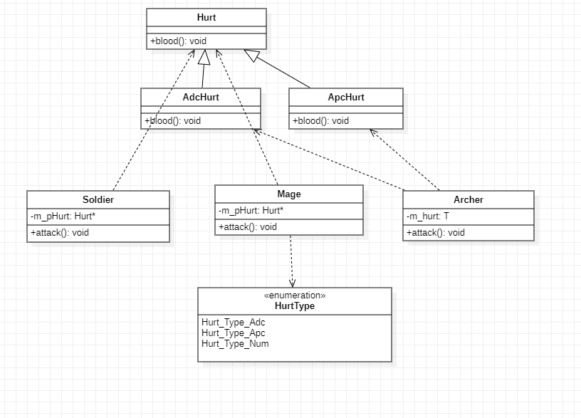

# 策略模式-传统策略模式

> 刘笑
>
> 2022.3.23


策略模式是指定义一系列的算法，把它们单独封装起来，并且使它们可以相互替换，使得算法可以独立于使用它的客户端而变化，也就是说这些算法所完成的功能类型是一样的，对外接口也是一样的，只是不同的策略为引起环境角色表现出不同的行为。

相比于使用大量的if...else，使用策略模式可以降低复杂度，使得代码更容易维护。

缺点：可能需要定义大量的策略类，并且这些策略类都要提供给客户端。

环境角色持有一个策略类的引用，最终给客户端调用。

**code**

```c++
/*
以游戏角色不同的攻击方式为不同的策略，游戏角色即为执行不同策略的环境角色
*/

#include <iostream>

//抽象策略类，提供一个接口
class Hurt
{
public:
	virtual void blood() = 0;
};

//具体的策略实现类，具体实现接口， Adc持续普通攻击
class AdcHurt : public Hurt
{
public:
	void blood() override
	{
		std::cout << "Adc hurt, Blood loss" << std::endl;
	}
};

// 具体策略实现类，具体实现接口，Apc节能攻击
class ApcHurt : public Hurt
{
public:
	void blood() override
	{
		std::cout << "Apc Hurt, blood loss" << std::endl;
	}
};

// 环境角色类，游戏角色战士，传入一个策略类指针参数
class Soldier
{
private:
	Hurt* m_pHurt;
public:
	Soldier(Hurt* hurt) : m_pHurt(hurt){}

	// 在不同策略下该游戏角色表现出不同的攻击
	void attack()
	{
		m_pHurt->blood();
	}
};

// 定义策略标签
typedef enum
{
	Hurt_Type_Adc,
	Hurt_Type_Apc,
	Hurt_Type_Num
}HurtType;

// 环境角色类，游戏角色法师，传入一个策略标签参数
class Mage
{
private:
	Hurt* m_pHurt;
public:
	Mage(HurtType type)
	{
		switch (type)
		{
		case Hurt_Type_Adc:
			m_pHurt = new AdcHurt();
			break;
		case Hurt_Type_Apc:
			m_pHurt = new ApcHurt();
			break;
		default:
			break;
		}
	}
	~Mage()
	{
		delete m_pHurt;
		m_pHurt = nullptr;
		std::cout << "~Mage()" << std::endl;
	}

	void attack()
	{
		m_pHurt->blood();
	}
};

// 环境角色类，游戏角色弓箭手，实现模板传递策略
template<typename T>
class Archer
{
private:
	T m_hurt;

public:
	void attack()
	{
		m_hurt.blood();
	}
};


int main() {
	AdcHurt* ah = new AdcHurt();
	Soldier* s = new Soldier(ah);
	s->attack();

	Mage *m = new Mage(Hurt_Type_Adc);
	m->attack();

	Archer<ApcHurt>* arc = new Archer<ApcHurt>;
	arc->attack();

	delete s;
	s = nullptr;
	delete ah;
	ah = nullptr;

	delete m;
	m = nullptr;

	delete arc;
	arc = nullptr;
	return 0;
}


```

UML

