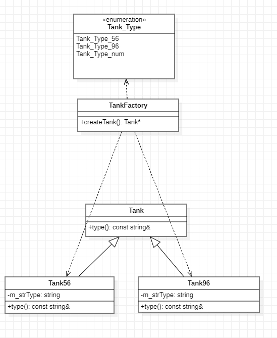

# 简单工厂模式

> 刘笑
>
> 2022.3.22

主要特点是需要在工厂类中做判断，从而创造相应的产品，当增加新产品时，需要修改工厂类。使用简单工厂模式，我们只需要知道具体的产品型号就可以创建一个产品。

缺点：工厂类集中了所有产品类的创建逻辑，如果产品量较大，会使得工厂类变得非常臃肿。

```c++
/*
简单工厂模式
*/


#include <iostream>

// 定义产品类型信息
typedef enum
{
	Tank_Type_56,
	Tank_Type_96,
	Tank_Type_Num
} Tank_Type;

// 抽象产品类
class Tank
{
public:
	virtual const std::string& type() = 0;
};

// 具体产品类
class Tank56 : public Tank
{
public:
	Tank56() : Tank(), m_strType("Tank56") {}

	const std::string& type() override
	{
		std::cout << m_strType.data() << std::endl;
		return m_strType;
	}

private:
	std::string m_strType;
};

// 具体产品类
class Tank96 : public Tank
{
public:
	Tank96() : Tank(), m_strType("Tank96") {}

	const std::string& type() override
	{
		std::cout << m_strType.data() << std::endl;
		return m_strType;
	}
private:
	std::string m_strType;
};

// 工厂类
class TankFactory
{
public:
	// 根据产品信息创建具体的产品实例，返回一个抽象产品类
	Tank* createTank(Tank_Type type)
	{
		switch (type)
		{
		case Tank_Type_56:
			return new Tank56();
		case Tank_Type_96:
			return new Tank96();
		default:
			break;
		}
	}
};

int main()
{
	TankFactory* factory = new TankFactory();
	Tank* tank56 = factory->createTank(Tank_Type_56);
	tank56->type();
	Tank* tank96 = factory->createTank(Tank_Type_96);
	tank96->type();

	delete tank96;
	tank96 = nullptr;
	delete tank56;
	tank56 = nullptr;
	delete factory;
	factory = nullptr;

	return 0;
}
```

UML图



